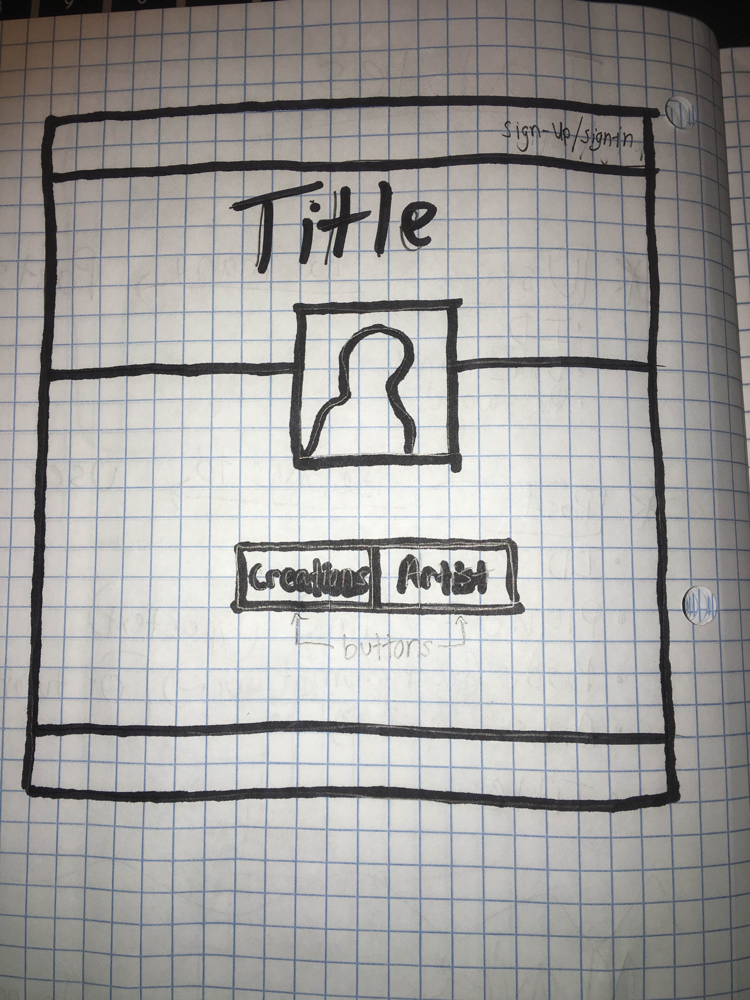
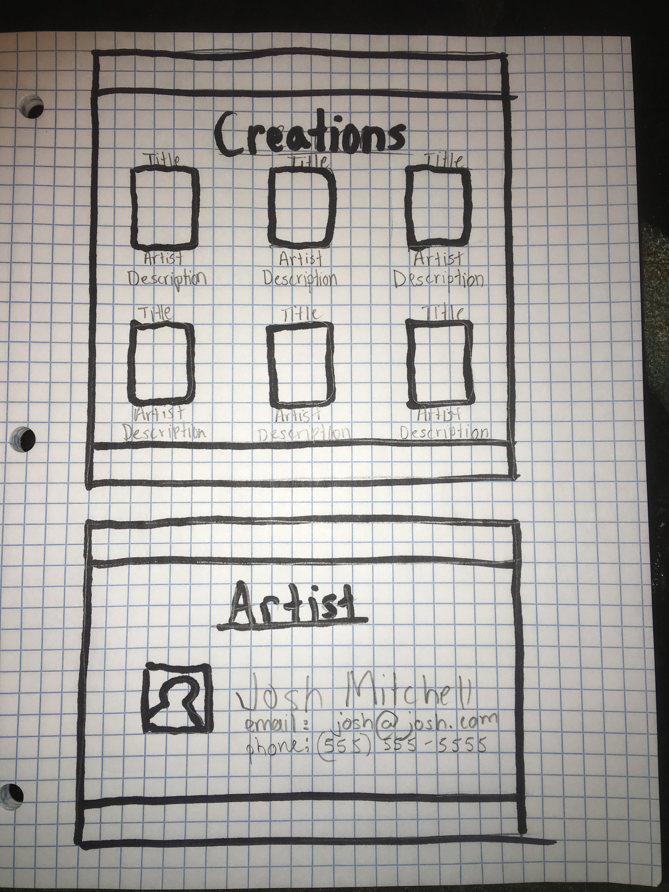

## Project Idea

What is your project idea?

I plan to make a blog style webpage for special effects makeup.  The blog will give the ability for users to sign-up and post their work for others to see, as well as list contact information so that others can reach out to get work done.

How did you come up with it? Why? Who would use it?

The idea came to me because I always thought it would be cool to have a website built to propmote my work as well as see other people's work.  I think the overall audience I would be aiming for, are people that would want special effects makeup done for Halloween and/or small films, etc.

## Write between 3-5 user stories

As a user, I want to be able to sign-up/sign-in so I post special effects makeup work that I have done.

As a user, I want to be able to look at other people's work so I can see what I like best.

As a user, I want to be able to contact artist so that I can get work done by them in the future.

As a user, I want to be able to view my creations, so that I can see where I've come as an artist.

## Plan your tables and columns

What tables will you need? What will the columns on the table be?

I'm going to have two tables: "Users" and "Posts".
The Users table will have three columns(ID, user_name, password).

The Creation table will five columns(ID, title, picture, description, contact_info).

If I have time, I may add in a "Comments" table, allowing users to post comments on the work of others.

## Create an ERD (entity relationship diagram)

These are the diagrams that show how your tables are related to one another.
(one to many, many to many, ect).

User 'has many' Creations
Creation 'belongs to' User

If I have a comments table:
Comments 'belong to' creation
Comments 'belong to' user

## Routing

What routes will you need to be able to make the proper request to your API?

Users:
post '/sign-up' => 'users#signup'
post '/sign-in' => 'users#signin'
delete '/sign-out/:id' => 'users#signout'
patch '/change-password/:id' => 'users#changepw'

Creation:
get '/creations' => 'creations#index'
get '/creations' => 'creations#show'
post '/creations' => 'creations#create'
delete '/creations/:id' => 'creations#destroy'

## 3rd Party APIs

Do you plan to use any, if so what are they?

No

## Wireframes

Please create a wireframe of your planned front end.

## Timetable

Write a basic timetable for yourself, you don't have to stick to it but it
helps to go in with a plan.

+Begin with building my API.
+Build up my front end
  -AJAX requests
  -javascript for forms
+CSS/HTML
+if there's time, build a comments table

## [License](LICENSE)

Source code distributed under the MIT license. Text and other assets copyright
General Assembly, Inc., all rights reserved.
